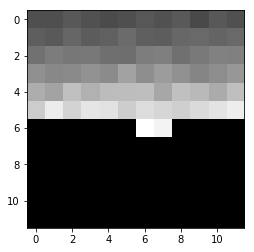
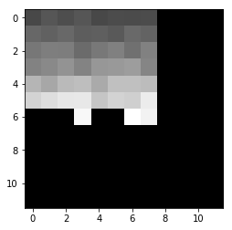
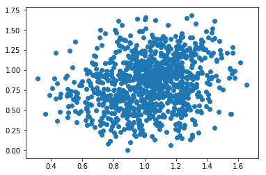
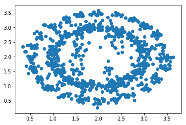

# Temporal Neural Network for Optical Flow

The Optical Flow algorithm consists of providing the apparent motion of objects, surfaces and edges in a visual scene. 

In this code, a new kind of optical flow algorithm has been developed. This algorithmis is very different from the classical optical flow algorithms for two main reasons:

    1. This algorithm is a machine learning algorithm based on neural network,
    2. The input data are not frames but events. 

The pixel of an event based camera only measures the difference of intensity and are independant from each other. Thus,an event based camera inly measures the "motion" of object.

The algorithm we developed here, is based on this technology:

For every event from the event based camera, its time stamp and the coordinate of the pixel (x, y) are stored.

When an event spikes, a 12 x 12 patch around this pixel is generated. Each neuron of this patch spikes the time stamp previously recorded.
A decay exponential function is then applied to this patch: f (t_current, t_old) = exp (− (t_current − t_old) / τ)
where t_current is the time of the spike which triggers the generation of the patch,  t_old is the time of the spike previously stored for every pixel of the patch and τ is an hyper-parameter of the algorithm.

Then for each patch, we obtained these kind of time surfaces:

However, some of these time surfaces cannot be used like this. In fact, the edges must not be used because of the aperture problem. Only the corners provide enough information to avoid the aperture problem. Thus these time surfaces must be processed in order to keep only the corners and remove all the other edges.

In order to select only the corner, the following "trick" was used:

    1. For each element of the first column, the last column, the first row and the last row of the time surface, we add them if they are above a specific threshold.

    2. This gives us 4 values (sum_first_col, sum_last_col, sum_first_row, sum_last_col). These values are then compared to a second specific threshold two by two: (sum_first_col, sum_first_row) or (sum_last_col, sum_first_row) or (sum_first_col, sum_last_row) or (sum_last_col, sum_first_row).

    3. When one of these 4 tuples is below the threshold, this means that the time surface corresponds to a corner.

Training

As said before, the input data used to train the neural network are only the time surfaces corresponding to the corners of the object.

The network is simply composed of:

    1 hidden layer with 40 neurons,
    1 output layer is composed of 2 two neurons corresponding to the speed (vx and vy)
    ReLu activation function is applied after the hidden layer and after the output layer.

The input are vector 12 x 12.

The training on Tensorflow is very fast and reach great accuracy. On the following pictures, we saw the improvement of the prediction on the training set:

Results

The accuracy obtained on the test set is low (RMSE = 0.28) and this the result we obtained with a synthetic data provided.

