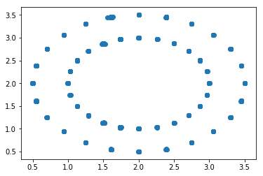

# Temporal Neural Network for Optical Flow

## Short overview of the algorithm

The Optical Flow algorithm consists of providing the apparent motion of objects, surfaces and edges in a visual scene. 

In this code, a new kind of optical flow algorithm has been developed. This algorithm is very different from the classical optical flow algorithms for two main reasons:

    1. This algorithm is a machine learning algorithm using fully connected neural network,
    2. The input data are not frames but events. 

The algorithm uses inputs from event based cameras. The pixels of an event based camera spikes only when they detect a change in brightness.

For every event from the event based camera, its time stamp and the coordinate of the pixel (x, y) are stored.

When an event spikes, a 12 x 12 patch around this pixel is generated. Each neuron of this patch spikes the time stamp previously recorded.
A decay exponential function is then applied to this patch (f (t_current, t_old) = exp (− (t_current − t_old) / τ))
where t_current is the time of the spike which triggers the generation of the patch,  t_old is the time of the spike previously stored for every pixel of the patch and τ is an hyper-parameter of the algorithm.

Then for each patch, we obtained these kind of time surfaces:

However, edges must not be used because of the aperture problem. Only the corners provide enough information to avoid the aperture problem. Thus these time surfaces must be processed in order to keep only the corners and remove all the other edges.

## Neural Network

The input data used to train the neural network are only the time surfaces corresponding to the corners of the object. It is a 12 x 12 vector.

The network is simply composed of:

    1 hidden layer with 40 neurons,
    1 output layer is composed of 2 two neurons corresponding to the speed (vx and vy)
    ReLu activation function is applied after the hidden layer and after the output layer.

The training on Tensorflow is very fast and reach great accuracy. On the following pictures, we saw the improvement of the prediction on the training set:

## Libraries used
Tensorflow / Numpy / Sklearn

## How to run the code ?

1. First the data must processed in order to only keep the cornes and remove the edges. The script which acheives this role is __process_data.py__. This script will generate two files *input_data.npy* and *output_data.npy* which contains the processed data. 

*python process_data.py -input='input/Bar_24x2_directions.txt' -output_speed='input/Bar_24x2_directions_xy.txt' -width=240 -height=304*

2. Then, the network must be trained. The script which acheives this role is __neural_network.py__. This script will generate the folder *tmp* which containes the neural network model parameters (weights, biases).

*python neural_network.py*

3. To visualize the results, the script __visualizer_arrow.py__ must be run. 

*python visualizer_arrow.py -input='input/Bar_24x2_directions.txt' -model='tmp/model.ckpt'*
